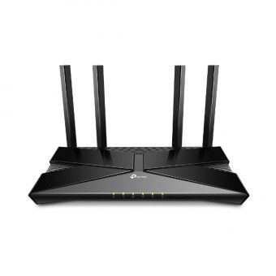
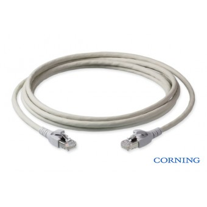
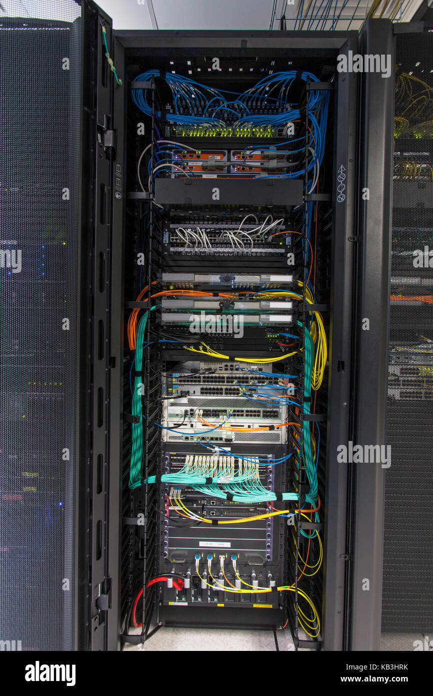

# Pr7.2Rackparaoficina

Para el armario del rack escogui uno grande, ya que es necesario por si se decide la ampliacion o duplicacion de los elementos. 

https://www.rackonline.es/armario-rack-i700-47u/rack-19-i700-47u-800-x-1000.html

En el caso de la alimentacion decidi poner una sae y un alargador de gran rendimiento, ya que esta estabilizara la corriente y en caso de perder la luz dara una cantiad de corriende como para finalizar sin necesidad de dañar componentes.

https://www.rackonline.es/avr-estabilizador-de-tension/avr-lapara-regulador-automatico-de-voltaje-10000-va.html

Para la coneccion de los diversos conectores se usara el ladron de este tipo.

https://www.rackonline.es/regleta-rack-19/regleta-rack-19-aluminio-16a-9-x-schuko-.html

Para el armario hace falta vias para poder gestionar de forma correcta el armario, estas son las que escogui.

https://www.rackonline.es/guias-rack-19/guia-ajustable-rack-19-470mm-800mm-fijacion-frontal.html

Tambian se puede usar estas guias que tiene todo lo necesario y solo hay que poner el componente sobre la via.

https://www.rackonline.es/bandejas-rack-19/bandeja-extraible-rack-19-f640-mm-.html

En caso de ser necesario se podria añadir una consola de control para la gestion de rack. 

Esta es la que escogui 

https://www.rackonline.es/consola-kvm-rack-19/consola-kvm-rack-19-cyberview-17.html

Para la refrigeracion de los componentes que se utilizara una refrigeracion activa de este tipo.

https://www.rackonline.es/ventilacion-rack-19/unidad-ventilacion-rack-6-ventiladores-fondo-350mm.html

En el caso del switch el que considero mas rentable y con que no requeriria extencion de estas seria este switch

https://www.rackonline.es/switch-para-red/edgeswitch-ubiquiti-gestionable-48-puertos-gigabit-2-ranuras-sfp-y-2-ranuras-sfp.html

La caja para el servidor seria esta la cual guardara los componentes necesararios.

https://www.rackonline.es/cajas-rack-atx-eatx/caja-rack-mini-itx-1u-250w-f310.html

El router selecionado para el rack seria este ya que tiene capacidad de 2.5 de 5 y de 6 siendo uno de los mejores

https://www.rackonline.es/router/router-tp-link-ax1500-wi-fi-6.html

En caso de necesitar un punto de acceso alterno al router se podria usar este punto de acceso.

https://www.rackonline.es/punto-de-acceso/punto-de-acceso-tp-link-inalambrico-n-a-300-mbps.html

En caso de que se necesiten mas bocas, se usara esta ampliacion de boca esto permitira la ampliacion sin necesidad de adquirir otro switch

https://www.rackonline.es/cableado-cat-5e/pach-panel-rack-2u-48-x-rj45-cat-5e.html

En caso de que queramos una cabeza de categoria 6 mas optimo, con resistencia al polvo se podria cambiar las bocas del ampliador por estas bocas.

https://www.rackonline.es/cableado-cat-6a-/modulo-rj45-cat6a-ftp-con-tapa-antipolvo-s500-corning.html

El cable que aconsegaria para su correcto funcionamiento seria.

https://www.rackonline.es/latiguillos-cat6a/latiguillo-rj45-cat6a-sftp-05m-azul-corning.html

En caso de que no queramos ese exceso y queramos cable mas normales.

https://www.rackonline.es/latiguillos-cat6a/latiguillo-rj45-cat6a-ftp-1m.html

Para la interconexion de la fibra queriremos una caja para el uso de la fibra en este caso la caja que elegui de trasporte es,

https://www.rackonline.es/cajas-de-fusion-y-empalme/caja-multioperadorusuario-de-fibra-optica-para-48-sc-simplex-lc-duplex-interior.html

El armario deberia quedar con un aspecto parecido a esto

